This manual teaches the `floodflow` R package from the ground up. It assumes no prior
hydrology and explains every term as it appears. **Part 1** runs the full pipeline in
*lumped* mode on the Odaw basin, Accra — inspired by the floods of June 2026. **Part 2** takes
the same functions into *spatial* mode, producing discharge, velocity, depth and time maps on a
real elevation model, so you can make maps for your own study areas. **Part 3** is a set of
exercises, projects, references and the code behind every figure.

Dr George Owusu
Department of Geography and Resource Development, University of Ghana

```
Version 0.2.0
Package: floodflow
Core runs in pure R — spatial maps use the 'terra' package
For: anyone modelling floods in R — geography, hydrology, environmental science,
     teaching or practice
Prerequisites: basic R literacy (no dplyr or ggplot2 needed)
License: MIT
```

> **Every number and figure in this manual was produced by running the package on real data.**
> Part 1 is built on `accra_rainfall` — a **real** 46-year daily rainfall record for Accra now
> bundled with the package (Section 4). The script that regenerates every figure,
> `reproduce_manual.R`, ships in this folder. The numbers were produced on R 4.6.0 with
> `floodflow` 0.2.0.

A note on the code tags above each block:
**▶ Runs on its own** — copy and run it by itself. **↑ Continues from above** — it uses
variables built earlier in the same section, so run them in order (or use the complete script in
Section 26). **○ Shown, not run here** — needs an external tool (like `whitebox`) or a file;
shown for reference.

---

## Contents

**Part 1 — the pipeline, step by step (lumped mode, Odaw basin, Accra)**
1. What this package does
2. Installing and loading
3. The project object: your workbench
4. Getting the data: real Accra rainfall (and fetching your own)
5. `flood_extremes()`: how big can the rain get?
6. `flood_scenario()`: what about the future?
7. Reality check: the June 2026 Accra floods
8. `roughness()`: how much does the ground slow water?
9. `flood_runoff()`: rain becomes river flow
10. The water balance: where the rain goes
11. `flood_route()`: where the water goes and how deep
12. `flood_hydraulics()`: timing and speed
13. `flood_uncertainty()`: how sure are we?
14. `flood_vulnerability()`: who and what is harmed?
15. `flood_surrogate()`: fast what-if analysis
16. `flood_map()`: drawing the result
17. The whole pipeline at a glance
18. Quick function reference

**Part 2 — from single numbers to maps (spatial mode)**
19. The elevation model (DEM)
20. Roughness from NDVI (a Manning's *n* map)
21. Calculating discharge two ways
22. The depth and inundation maps
23. The velocity map
24. Time-bound maps
25. The complete spatial script
26. Maps for every day, not just the peak
27. Saving your maps, and troubleshooting

**Part 3 — exercises, projects and reference**
28. Citing floodflow
29. Reproducing the figures
30. Glossary of terms
31. Exercises
32. Projects
33. References
34. Appendix: the code behind every figure

---

# PART 1 — The pipeline, step by step

*Running floodflow in lumped mode on the Odaw basin, Accra.*

## 1. What this package does

A flood model answers a practical chain of questions: how much rain can fall, how much of it
becomes river flow, how deep the water gets, how fast it moves, how sure we are, and finally who
and what is harmed. `floodflow` connects all of these into one pipeline, designed for places
where data is scarce — which describes most of the world.

The package has one guiding idea: it is **map-first**. Every stage produces something you could
draw on a map, because a flood is a geographic event. It is also **climate-aware**: any flood
can be modelled under today's climate or under a warmer future, side by side.

**Key terms, defined once**

- **Catchment (or basin)** — the area of land where all rainfall drains to a common outlet. The
  Odaw basin drains much of Accra.
- **Discharge** — the volume of water flowing past a point per second (m³/s), or as a depth of
  runoff (mm/day).
- **Return period** — how often, on average, a rainfall of a given size is expected. A
  '100-year rainfall' has a 1-in-100 (1%) chance of being exceeded in any year.
- **Design event** — the rainfall or flood of a chosen return period that engineers plan for.
- **Manning's *n*** — a roughness number describing how much a surface slows water. Smooth
  concrete is low (~0.015); a vegetated channel is high (~0.1).
- **Hydrograph** — a graph of discharge over time, a flood rising to a peak and falling back.

## 2. Installing and loading

**○ Shown, not run here**

```r
install.packages("floodflow")     # from CRAN
# or the development version:
# remotes::install_github("gowusu/floodflow")
```

```r
library(floodflow)
```

That is all you need. The core is pure R. Some stages can optionally use extra 'engine'
packages for more power (`airGR` for advanced runoff, `terra` for maps), but every stage works
without them by falling back to a built-in method — you never get stuck because a package is
missing.

**Quick start: a result in 30 seconds.** Rainfall in, flood depth out.

**▶ Runs on its own**

```r
library(floodflow)
fp <- flood_project("test")
fp$rainfall <- data.frame(date = Sys.Date() + 0:10,
                          precip_mm = c(0,0,0,20,50,30,10,0,0,0,0))
fp <- flood_runoff(fp, lat_deg = 5.6)
fp <- flood_route(fp, width = 25, slope = 0.002, area_km2 = 400)
fp$route$peak_depth_m        #> ~2.07 m
```

That is the whole idea in six lines. The rest of the manual unpacks each step and adds
scenarios, uncertainty and maps.

> **System requirements.** R ≥ 4.1 on Windows, macOS or Linux. For spatial runs, install
> `terra`; 4 GB RAM is comfortable for basins up to a few hundred thousand cells. The
> LDD / cumulative-discharge step needs `whitebox` installed separately (`whitebox::wbt_init()`).

## 3. The project object: your workbench

Everything in floodflow revolves around one object created by `flood_project()`. Think of it as
a workbench that carries your data and results from stage to stage.

**▶ Runs on its own**

```r
fp <- flood_project("Odaw basin, Accra", crs = "EPSG:32630")
fp
#> <flood_project>
#>   name: Odaw basin, Accra
#>   crs: EPSG:32630
#>   populated: <none yet>
```

The `crs` is the coordinate reference system — the map projection your data uses. `EPSG:32630`
is the metric UTM zone covering Accra. As we run each stage, the `populated` line fills up.

## 4. Getting the data: real Accra rainfall (and fetching your own)

A flood model is only as good as its rainfall. This manual uses **real, observed-and-reanalysis
data** — a 46-year daily record for Accra that ships with the package as `accra_rainfall`. It
comes from **NASA POWER** (a free, global satellite-and-model service), retrieved with the
`sebkc::weather()` function, and is **bundled inside floodflow so the manual keeps working even
if the online service is ever unavailable.** Load it and drop it onto the workbench:

**▶ Runs on its own**

```r
data("accra_rainfall")          # ships with floodflow
head(accra_rainfall)
#>         date precip_mm temp_c
#> 1 1981-01-01       0.1   26.9
#> 2 1981-01-02       0.1   27.2
#> ...
nrow(accra_rainfall)            #> 16637 days, 1981-01-01 to 2026-07-20

fp$rainfall <- accra_rainfall
```

The record has three columns: `date`, `precip_mm` (daily rainfall in millimetres) and `temp_c`
(daily mean temperature, used later for evaporation). **That `date` + `precip_mm` shape is all
floodflow ever needs for rainfall** — swap in your own gauge data in the same format and
everything else works unchanged. A quick look at the record:

- **Days of record:** 16,637 (1981-01-01 → 2026-07-20)
- **Wettest day:** 110.5 mm, on 2023-07-08
- **Mean annual rainfall:** ~1,200 mm — Accra's coastal-savanna climate, with a major wet season
  around June and a minor one around October.

### Fetching your own record

Nothing here is special to Accra except the coordinates. To build the same record for **your**
location, use `sebkc::weather()` — it needs only a longitude and latitude (west and south are
negative). This is shown for reference; you do not need to run it, because the Accra data is
already bundled.

**○ Shown, not run here**

```r
# install.packages("sebkc")
library(sebkc)
# real daily weather for any point, straight from NASA POWER:
w  <- weather(longitude = -0.20, latitude = 5.60,
              NASA.SSE = list(from = "1981-01-01", to = "2026-07-20"))
wx <- w$NASA.SEE$data                      # Tmax Tmin RH uz Rs P date ...
rain <- data.frame(date = as.Date(wx$date),
                   precip_mm = wx$P,        # NASA POWER PRECTOTCORR
                   temp_c    = wx$Tmean)    # NASA POWER T2M
```

Prefer a spreadsheet? The same data downloads by hand from the **NASA POWER Data Access Viewer**
(<https://power.larc.nasa.gov/data-access-viewer/>): pick a point, choose *Daily*, tick
precipitation and temperature, and export CSV. Other free daily sources you can line up into the
same `date, precip_mm` shape include **Open-Meteo** (<https://open-meteo.com>) and **ERA5** via
the Copernicus CDS.

## 5. `flood_extremes()`: how big can the rain get?

The first analytical stage asks: given our record, how large is the rare, dangerous rainfall? It
fits a **GEV** distribution (Generalized Extreme Value — the standard model for annual maxima)
to the biggest rainfall of each year, then reads off design rainfall by return period. It also
tests whether extremes are **changing**: it fits a steady ('stationary') version and a
trend ('non-stationary') version and compares them with a likelihood-ratio test.

**↑ Continues from above**

```r
fp <- flood_extremes(fp)
fp$extremes
#> <flood_extremes>
#>   years of record: 46
#>   GEV (stationary): mu=30.47 sigma=9.18 shape=0.252
#>   location trend (mm/yr): 0.0427
#>   trend test: LR=0.13 p=0.72  (no significant trend)
#>   return levels (mm):
#>        2-yr: 34.0
#>       10-yr: 58.3
#>       25-yr: 75.6
#>       50-yr: 91.4
#>      100-yr: 110.1
```

**Reading this output.** `mu, sigma, shape` are the three GEV parameters — location (centre),
scale (spread) and shape (tail heaviness); the package fits them. The **return levels** are the
headline: the 100-year daily rainfall for Accra is about **110 mm**.

**The trend test — an honest result.** Over this 46-year record the daily maxima show **no
statistically significant upward trend** (LR = 0.13, p = 0.72). Read this carefully: it does
*not* mean the climate is unchanging. A 46-year satellite-era record is short and spatially
coarse for detecting a trend in *rare* events, and seasonal or monthly totals — or a longer,
finer record — may tell a different story. What the data *do* say is important in its own right:
**even a climate with no detectable trend in daily maxima produces devastating rare events**, as
Section 7 shows starkly. The stationary-vs-nonstationary machinery is still exactly what you run
on your own basin; here it happens to report "not significant".

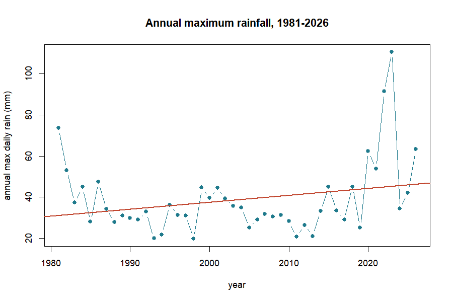

*Figure 1. Accra's annual maximum daily rainfall, 1981–2026. The straight regression line drifts
up a little — pulled by the wet years 2022–2023 — but the rigorous GEV likelihood-ratio test
finds no statistically significant trend (p = 0.72). A short record and a couple of wet years can
look like a trend without being one.*

> **The equation behind this: GEV return levels.** A return level is the rainfall expected once
> every `T` years. The GEV turns the three fitted parameters — location μ, scale σ, shape ξ —
> into that rainfall with one formula:
>
> $$ x_T = \mu + \frac{\sigma}{\xi}\left[(-\ln(1 - 1/T))^{-\xi} - 1\right] $$
>
> With μ = 30.47, σ = 9.18, ξ = 0.252, the 100-year storm (T = 100) works out to ≈ 110 mm —
> exactly the value the package reports.

## 6. `flood_scenario()`: what about the future?

Today's 100-year storm will not be the future's 100-year storm. `flood_scenario()` adjusts the
design rainfall for a changed climate. The simplest robust method for data-scarce settings is
the **delta method**: multiply by a change factor from climate projections. Here we apply +20%,
a plausible mid-century value under the SSP2-4.5 pathway (a moderate-emissions future).

**↑ Continues from above**

```r
fp <- flood_scenario(fp, method = "delta", change_factor = 1.20,
                     scenario_label = "SSP2-4.5 2050")
fp$scenario
#> <flood_scenario>
#>   method: delta  label: SSP2-4.5 2050
#>   period   baseline   adjusted   change
#>       2-yr      34.0       40.8    x1.20
#>      10-yr      58.3       69.9    x1.20
#>      25-yr      75.6       90.7    x1.20
#>      50-yr      91.4      109.7    x1.20
#>     100-yr     110.1      132.1    x1.20
```

Today's 100-year rainfall is 110 mm; under this scenario it becomes **132 mm**. A storm that is
rare today becomes noticeably more common in a warmer Accra — the essence of why planning for
climate change matters even when the historical trend is undetectable.

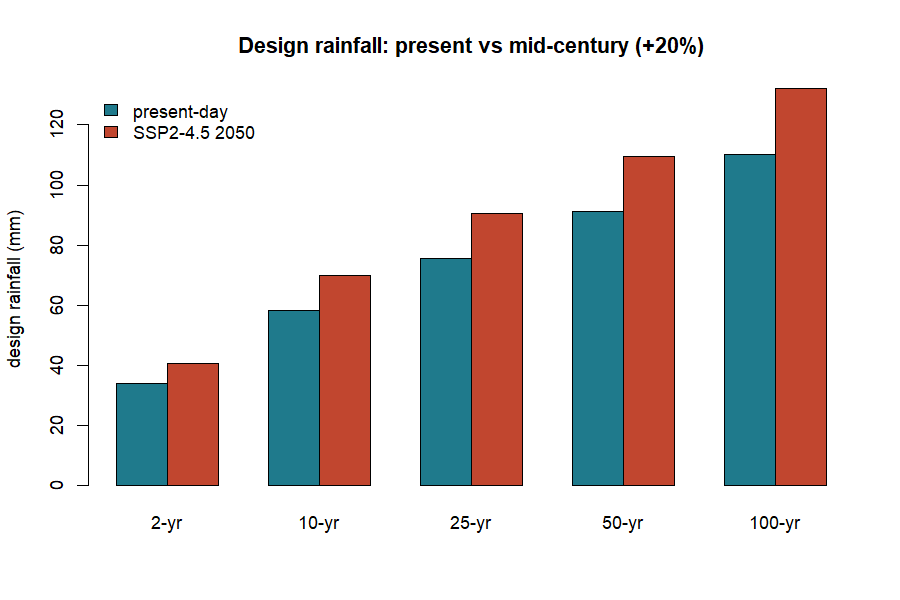

*Figure 2. Present-day design rainfall (blue) and the mid-century SSP2-4.5 estimate (+20%, red),
by return period.*

Other methods: `method = "trend"` projects the fitted trend forward to a horizon year;
`method = "cmip6"` is reserved for feeding in downscaled climate-model output directly.

## 7. Reality check: the June 2026 Accra floods

The scenarios above are model projections. But while this package was being written, Accra lived
the reality. On Monday, 29 June 2026, the city flooded catastrophically after an extraordinary
downpour. According to the Ghana Meteorological Agency (GMet), reported to Parliament, that
single day delivered **169.2 mm** of rain. June 2026 became the **wettest month in Ghana's
recorded history**, with a cumulative **593.2 mm**, surpassing the previous records of 420.6 mm
(2002) and 380.3 mm (2015). The floods claimed lives, displaced nearly 39,000 people and drew a
GHS 350 million emergency response.

> **Why this section matters.** The rest of the manual uses the bundled `accra_rainfall` record
> so it is reproducible. This section uses the real, officially reported figures from GMet and
> Parliament (June 2026) as a teaching case — to test whether our modelled 'future' scenarios
> were bold enough against what actually happened.

**Where the 2026 event lands.** Our present-day 100-year storm is 110 mm; our SSP2-4.5
mid-century (2050) 100-year storm is 132 mm. The real 29 June event (169.2 mm) exceeded **even
the 2050 projection** by 37 mm. We can ask the package directly how rare that is, by feeding it
into the fitted GEV.

**▶ Runs on its own**

```r
# using the fitted GEV parameters from flood_extremes()
return_period <- function(x, mu, sigma, xi) {
  z <- 1 + xi * (x - mu) / sigma
  1 / (1 - exp(-z^(-1 / xi)))
}
return_period(169.2, 30.47, 9.18, 0.252)              #> ~511 years (present-day)
return_period(169.2, 30.47*1.2, 9.18*1.2, 0.252)      #> ~255 years (+20% scenario)
```

Under today's statistics the event looks like a **1-in-511-year** storm; even under the warmer
+20% scenario it is still a **1-in-255-year** storm. Extraordinarily rare on paper — yet it
happened. **This is the practical lesson of the whole manual:** a record can show *no significant
trend* and still deliver, within its own span, an event far beyond the 100-year — even beyond a
mid-century projection. Design standards built on the historical record alone can badly
understate the true hazard.

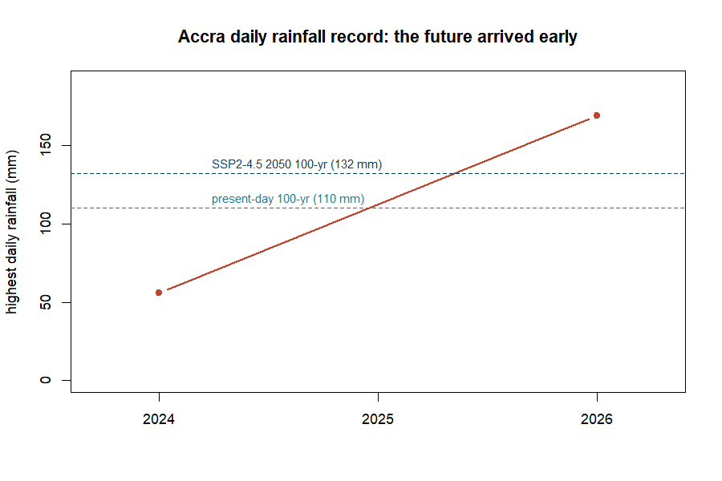

*Figure 3. The 2026 event against the manual's design storms. The dashed lines are the
present-day (110 mm) and mid-century (132 mm) 100-year storms from Sections 5–6.*

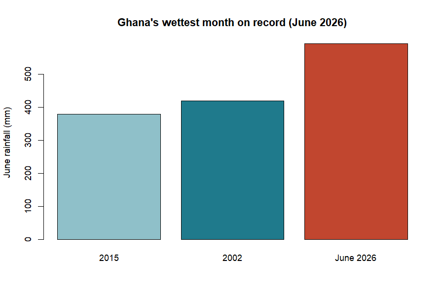

*Figure 4. Ghana's wettest month on record (source: GMet figures reported to Parliament, June
2026).*

For the modeller, the takeaway is humility and vigilance: use climate scenarios, but treat them
as a floor, not a ceiling, and cross-check modelled extremes against the newest observations.

## 8. `roughness()`: how much does the ground slow water?

Before we can turn rain into a flood we need **Manning's *n*** — the roughness of the channel
and land, the single most influential hydraulic setting. The simplest option is one constant
value everywhere:

**↑ Continues from above**

```r
fp <- roughness(fp, method = "constant", value = 0.035)
```

A value of 0.035 is typical for a natural earth channel. Two richer options exist:
`method = "landcover"` looks up roughness from land-cover classes, and `method = "ndvi"` derives
it from satellite vegetation greenness (both read maps when `terra` is installed). The built-in
lookup table shows the idea:

| Land cover | Manning's *n* | | Land cover | Manning's *n* |
|---|:--:|---|---|:--:|
| water | 0.030 | | cropland | 0.040 |
| urban / paved | 0.015 | | shrub | 0.050 |
| bare soil | 0.025 | | wetland | 0.070 |
| grassland | 0.035 | | forest | 0.100 |

*Table 1. The `floodflow_lc_roughness` lookup table. Rougher surfaces (forest, wetland) slow
water more.*

## 9. `flood_runoff()`: rain becomes river flow

Not all rain becomes flood; some soaks in or evaporates. `flood_runoff()` converts the rainfall
record into a discharge series. It first works out evapotranspiration — water lost to the air
and plants — using the **Oudin** formula, which needs only temperature and latitude, perfect for
data-scarce places. (It reads the `temp_c` column of `accra_rainfall`; without one it assumes a
constant 28 °C.)

**↑ Continues from above**

```r
fp <- flood_runoff(fp, lat_deg = 5.6, engine = "simple")
fp$runoff
#> <flood_runoff>
#>   engine: simple (fallback)
#>   days:   16637
#>   peak discharge: 114.98 mm/day on 2023-07-10
#>   mean PET: 4.59 mm/day
```

Here PET is potential evapotranspiration (the atmosphere's 'thirst'), and 4.59 mm/day is
realistic for hot, sunny Accra. The `"simple"` engine is the built-in model; installing `airGR`
and setting `engine = "airGR"` switches to the professional GR4J rainfall-runoff model.

> **floodflow works on a daily timestep.** Each row of rainfall is one day; discharge is
> mm/day. For hourly data, sum it to daily totals first.

**Where does infiltration go?** Inside `flood_runoff()` a *production store* (a soil-moisture
bucket) decides how much rain soaks in versus runs off: when the soil is dry, most rain
infiltrates; as it saturates, the runoff fraction climbs toward one. Infiltration is handled
implicitly, through soil storage.

> **The equation behind this: Oudin evapotranspiration.**
> $$ \text{PET} = \frac{R_a}{\lambda\rho}\cdot\frac{T + 5}{100} \quad\text{when } T + 5 > 0,\ \text{else } 0 $$
> where $R_a$ is the sun's energy at the top of the atmosphere (from day-of-year and latitude),
> $\lambda\rho$ converts energy to water depth, and $T$ is temperature. floodflow exposes this
> as `pet_oudin()`.

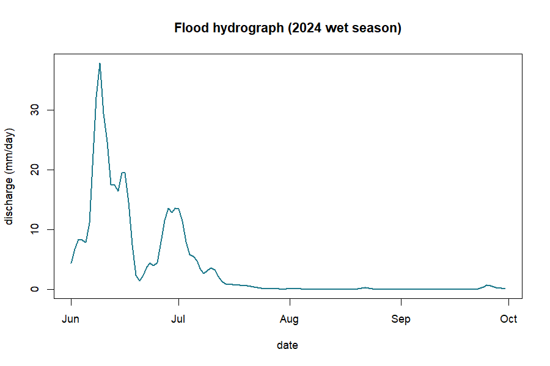

*Figure 5. A wet-season flood hydrograph — the flood wave the next stage will route.*

## 10. The water balance: where the rain goes

Rain that falls does not all become flood. Some evaporates or is taken up by plants (PET), some
soaks into the soil and is stored, and only the rest runs off. This partition is the **water
balance**.

> **The idea behind this: the water balance.**
> $$ P = Q + AET + \Delta S $$
> Rainfall (P) splits three ways: runoff (Q, the flood-making part), actual evaporation (AET) and
> the change in soil-water storage (ΔS). Over a long period ΔS averages near zero, so most rain
> leaves as either runoff or evaporation.

**↑ Continues from above**

```r
P <- sum(fp$rainfall$precip_mm)          # total rainfall (mm)
Q <- sum(fp$runoff$discharge$Q_mm)       # total runoff (mm)
c(rainfall = round(P), runoff = round(Q), ratio = round(Q / P, 3))
#>  rainfall    runoff    ratio
#>     54749     30772    0.562
```

Over the full 46-year record, of ~54,700 mm of rain about 30,800 mm (a **runoff ratio of 0.56**)
became streamflow in this simple model; the rest evaporated or was stored. The runoff ratio is
the number to watch: it rises sharply when the soil is already wet, which is why the *same* rain
makes a far bigger flood on saturated ground — the role of antecedent wetness.

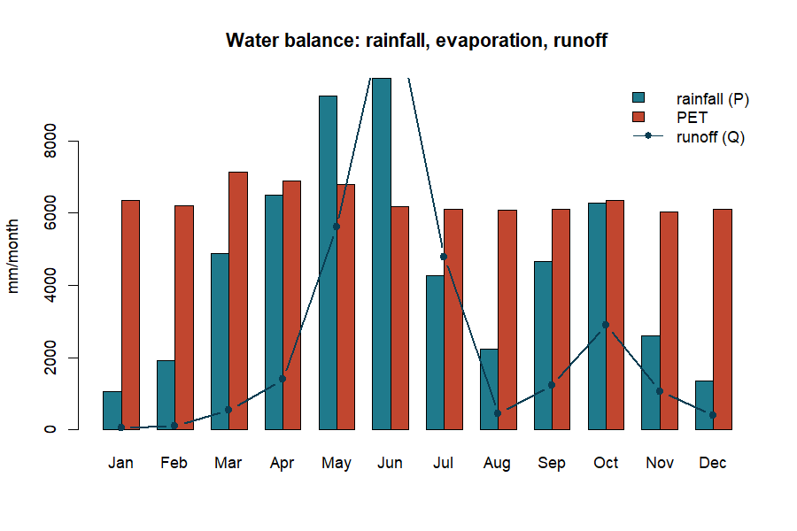

*Figure 6. Rainfall (blue), evaporative demand PET (red) and runoff (line), by month.*

> **An honest limit.** The built-in `"simple"` engine is a runoff generator, not a fully
> mass-conserving water-balance model. It is perfect for seeing the *partition* of rainfall; for
> a strict closed balance use the calibrated GR4J model via `engine = "airGR"`.

## 11. `flood_route()`: where the water goes and how deep

This is the heart of the flood model. `flood_route()` moves the flood wave down the channel and
computes water depth. It offers five methods forming a 'ladder' from simple to sophisticated;
all compute depth from Manning's equation but differ in how the peak spreads and shrinks
(**attenuates**) as it travels.

**↑ Continues from above**

```r
fp <- flood_route(fp, method = "muskingum-cunge",
                  width = 25, slope = 0.002, area_km2 = 400)
fp$route
#> <flood_route>
#>   method: muskingum-cunge
#>   peak depth:    5.40 m
#>   peak velocity: 3.93 m/s
#>   attenuation:   0.996 (routed peak / inflow peak)
#>   channel: width=25m  slope=0.002  n=0.035
```

So the design flood is about **5.4 metres deep**, moving at **3.9 m/s** — fast and dangerous.
The attenuation of 0.996 means the routed peak kept 99.6% of its height over this reach.

**The five-method ladder.** `manning-normal` — steady flow, no wave movement (quick baseline).
`kinematic` — the wave travels but barely flattens (steep channels). `diffusive` — the wave
flattens realistically. `muskingum-cunge` — the practical default: accurate and cheap.
`dynamic` — the most complete stable approximation in pure R.

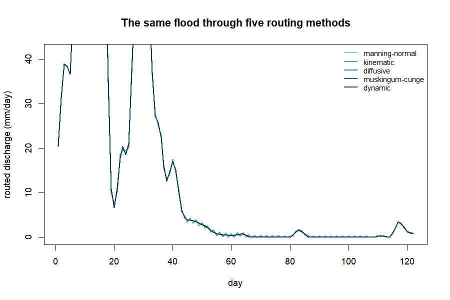

*Figure 7. Simpler methods keep more of the peak; adding physics attenuates it more.*

> **The equation behind this: Muskingum-Cunge routing.**
> $$ O_2 = C_0 I_2 + C_1 I_1 + C_2 O_1 $$
> Each new outflow $O_2$ is a weighted blend of inflow and outflow at the previous step; the
> weights $C_0, C_1, C_2$ (summing to 1) carry the wave's speed and spreading, so the peak
> arrives later and lower downstream.

> **An honest limit.** Even the `dynamic` method is a stable 1-D approximation, not a full 2-D
> hydrodynamic simulation. For detailed floodplain mapping, couple floodflow to LISFLOOD-FP or
> HEC-RAS.

## 12. `flood_hydraulics()`: timing and speed

A flood has speed and timing that matter for warnings and escape. `flood_hydraulics()` derives
these from the routed flow.

**↑ Continues from above**

```r
fp <- flood_hydraulics(fp, length_m = 12000, overland_m = 200)
fp$hydraulics$tc
#>       kirpich         kerby kerby_kirpich      velocity
#>        295.19         48.01        339.41         50.88
```

These are four estimates of the **time of concentration** — how long water takes to travel from
the farthest point of the catchment to the outlet, a key control on how fast a flood builds.
`Kirpich` suits channel flow; `Kerby` the shallow overland part; `kerby_kirpich` combines them;
`velocity` uses the routed flow speed.

> **The equation behind this: Kirpich time of concentration.**
> $$ t_c = 0.0195 \cdot L^{0.77} \cdot S^{-0.385} \quad\text{(minutes)} $$
> from channel length $L$ (m) and slope $S$. Steeper catchments drain faster. Exposed as
> `tc_kirpich(length_m, slope)`.

## 13. `flood_uncertainty()`: how sure are we?

Rather than pretend our 5.4 m is exact, `flood_uncertainty()` quantifies the doubt using
**GLUE** (Generalized Likelihood Uncertainty Estimation): it tries thousands of plausible
parameter sets, keeps those matching an observed flood depth, and reports a range. Suppose
surveyors measured a 5.4 m high-water mark:

**↑ Continues from above**

```r
fp <- flood_uncertainty(fp, observed_depth_m = 5.4, n_sim = 3000, seed = 1)
fp$uncertainty
#> <flood_uncertainty> (GLUE)
#>   observed depth:   5.40 m
#>   behavioural sets: 300
#>   90% depth band:   [5.13, 5.67] m (median 5.40)
#>   observed in band: TRUE
#>   inverse estimates:
#>     Manning n: 0.0412  [0.0207, 0.0597]
#>     width:     29.3 m  [14.1, 39.9]
#>   equifinality (n-width corr): 0.97
```

Instead of a single number we have a **90% band of 5.13–5.67 m** — an honest statement of
confidence. The stage also solves the inverse problem (what roughness and width best explain the
observed flood) and reports that many combinations fit equally well — **equifinality** (here the
`n`–width correlation is 0.97), which the package surfaces rather than hides.

## 14. `flood_vulnerability()`: who and what is harmed?

A flood becomes a disaster where it meets people and property. `flood_vulnerability()` combines
three layers into a risk map using the standard formula **Risk = Hazard × Exposure ×
Vulnerability**. Because it multiplies, risk is zero wherever any factor is zero.

**↑ Continues from above**

```r
set.seed(7)
fp <- flood_vulnerability(fp,
        exposure = rpois(100, 60),    # population per cell
        vulnerability = runif(100))   # deprivation index
fp$vulnerability
#> <flood_vulnerability> (Hazard x Exposure x Vulnerability)
#>   risk index: min=0.000 mean=0.309 max=1.000
#>   components: hazard, exposure, vulnerability
```

The result is a risk index from 0 to 1. The highest values are the hotspots — where deep water,
dense population and social vulnerability coincide — exactly where a city like Accra would focus
drainage upgrades and early warning. **Hazard** = the physical flood; **Exposure** = what is in
harm's way; **Vulnerability** = how susceptible those exposed are.

## 15. `flood_surrogate()`: fast what-if analysis

Running the full model many times can be slow. `flood_surrogate()` trains a fast emulator that
mimics the depth model, so you can explore 'what if' questions instantly.

**↑ Continues from above**

```r
fp <- flood_surrogate(fp, n_train = 400, seed = 2)
fp$meta$surrogate$predict(data.frame(Q = 150, n = 0.04, width = 25))
```

The in-sample fit is R² = 1.00 because Manning's law is exactly log-linear; with `ranger`
installed it uses a random forest for more general problems. A convenience for rapid
exploration — not a replacement for the real model.

## 16. `flood_map()`: drawing the result

The map-first payoff. `flood_map()` renders any layer — depth, risk, velocity or uncertainty.
With `tmap` or `leaflet` and spatial data it draws an interactive map; without them it returns a
tidy numeric summary so your workflow never breaks.

**↑ Continues from above**

```r
m <- flood_map(fp, layer = "depth")
m$data
#>  layer  min mean  max
#>  depth 5.40 5.40 5.40
```

In a real spatial run this would be a full depth map of the Odaw basin (Part 2).

## 17. The whole pipeline at a glance

The complete Accra analysis, start to finish — a real, runnable script.

**▶ Runs on its own**

```r
library(floodflow)
data("accra_rainfall")

fp <- flood_project("Odaw basin, Accra", crs = "EPSG:32630")
fp$rainfall <- accra_rainfall
fp <- flood_extremes(fp)
fp <- flood_scenario(fp, method = "delta", change_factor = 1.20)
fp <- roughness(fp, method = "constant", value = 0.035)
fp <- flood_runoff(fp, lat_deg = 5.6, engine = "simple")
fp <- flood_route(fp, method = "muskingum-cunge", width = 25, slope = 0.002, area_km2 = 400)
fp <- flood_hydraulics(fp, length_m = 12000)
fp <- flood_uncertainty(fp, observed_depth_m = 5.4)
fp
```

**The Accra story in numbers**

| Question | floodflow's answer |
|---|---|
| How big is the 100-yr storm today? | **110 mm/day** |
| …and mid-century (SSP2-4.5)? | **132 mm/day** (+20%) |
| Are daily extremes intensifying? | **No significant trend** (p = 0.72) |
| Can a rare event still exceed design? | **Yes** — 29 Jun 2026 hit 169 mm (~1-in-511 yr) |
| How deep is the design flood? | **5.40 m** |
| How fast does it flow? | **3.93 m/s** |
| How confident (90% band)? | **5.13 – 5.67 m** |
| Where is risk highest? | dense + deprived + deep cells |

*Table 2. The complete flood assessment for the Odaw basin, produced entirely by floodflow on
real Accra rainfall.*

## 18. Quick function reference

| Function | What it does | Optional engine |
|---|---|---|
| `flood_project()` | create the workbench object | — |
| `flood_extremes()` | design rainfall + trend test | extRemes |
| `flood_scenario()` | climate-adjust the design event | — |
| `roughness()` | assign Manning's *n* | terra |
| `flood_runoff()` | rainfall → discharge | airGR |
| `flood_route()` | route the wave, compute depth | — |
| `flood_hydraulics()` | time of concentration, speed | — |
| `flood_uncertainty()` | GLUE uncertainty band | — |
| `flood_vulnerability()` | risk = hazard × exposure × vuln. | — |
| `flood_surrogate()` | fast ML emulator | ranger |
| `flood_map()` | draw a layer | tmap, leaflet |

---

# PART 2 — From single numbers to maps

*The same functions in spatial mode. Part 2 uses the base-R `volcano` grid as a stand-in DEM so
every block runs immediately; change the two lines marked `YOUR DATA` to use your own basin.*

## 19. The elevation model (DEM)

A flood is shaped by terrain. Everything spatial starts from a **DEM** — a raster of ground
height. We load one and derive slope and a HAND (Height Above Nearest Drainage) surface.

**▶ Runs on its own**

```r
library(terra); library(floodflow)
dem <- rast(volcano)                 # YOUR DATA: rast("dem.tif")
crs(dem) <- "EPSG:32630"
slope <- terrain(dem, v = "slope", unit = "radians")
slope_tan <- app(tan(slope), function(v) ifelse(v < 1e-4, 1e-4, v))
hand <- dem - global(dem, "min", na.rm = TRUE)[1,1]   # HAND proxy
plot(dem, main = "Elevation (DEM)")
```

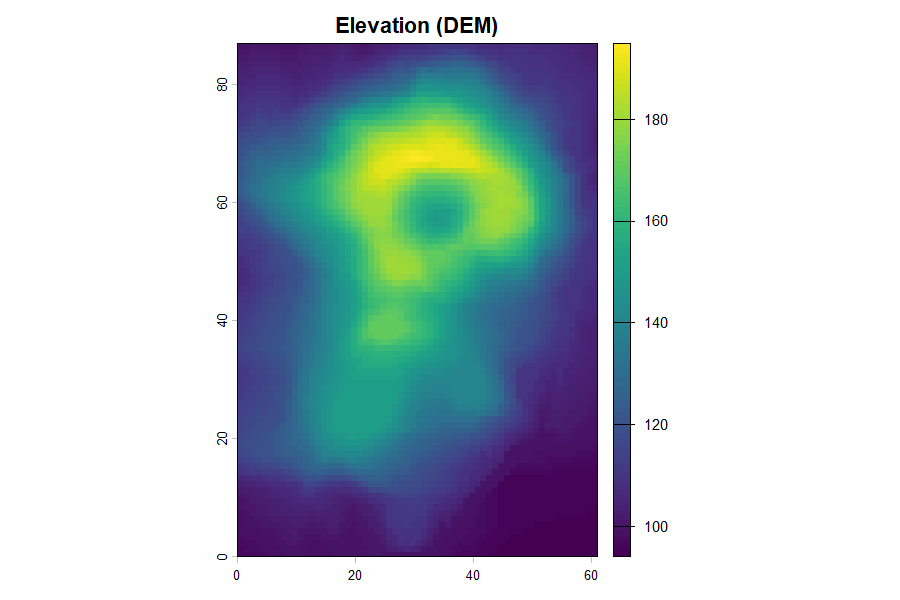

*Figure 8. The elevation model; flow runs from warm ridges to cool valley floors.*

## 20. Roughness from NDVI (a Manning's *n* map)

Vegetation slows water. `roughness()` turns an **NDVI** greenness raster into a Manning's *n*
map: bare, low-NDVI cells shed water; green cells resist it.

**↑ Continues from above**

```r
ndvi <- app(0.8 - 0.6*(dem-global(dem,"min",na.rm=TRUE)[1,1]) /
        (global(dem,"max",na.rm=TRUE)[1,1]-global(dem,"min",na.rm=TRUE)[1,1]),
        function(v) pmin(pmax(v,0),1))          # YOUR DATA: rast("ndvi.tif")
manning <- roughness(ndvi, method = "ndvi")$n
plot(manning, main = "Manning's n")
```

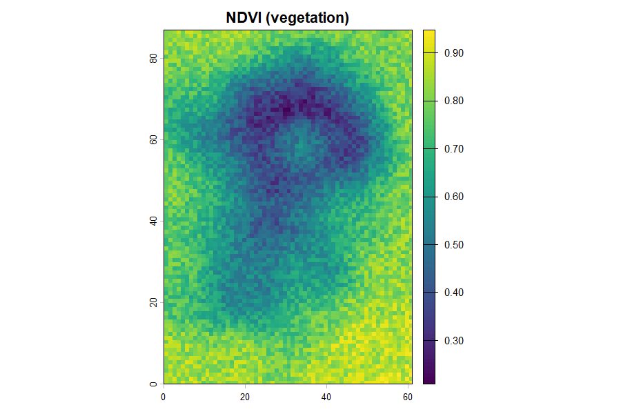

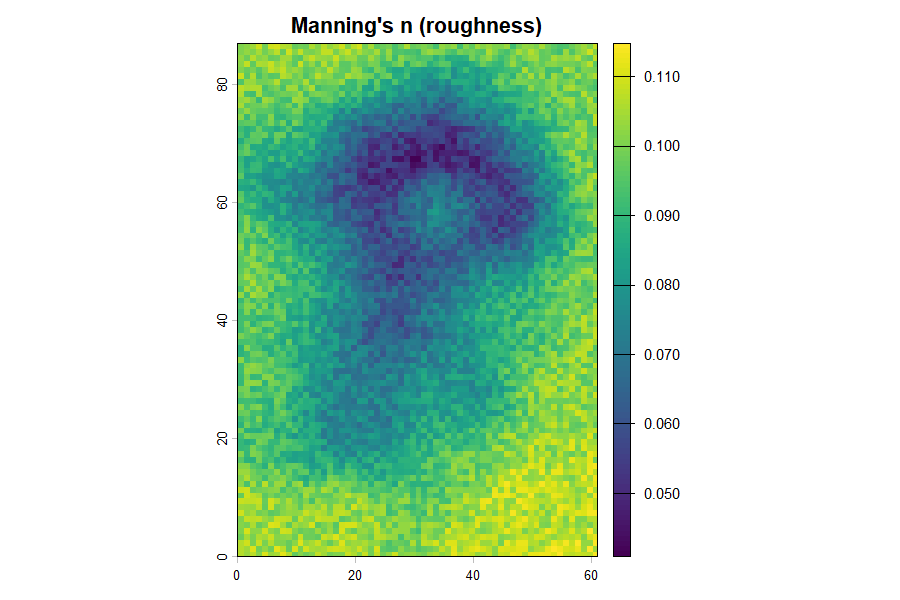

*Figures 9–10. Greener ground (high NDVI) becomes rougher (higher n) and slows water more.*

## 21. Calculating discharge two ways

There are two useful discharges. **Manning discharge (per cell)** is the flow *capacity* at a
point — useful for sizing a channel or culvert. **Cumulative LDD discharge** is how much water
actually *arrives* at a point from everything upstream — the right quantity for flood magnitude
at the outlet. Good practice uses both.

The cumulative route uses a local drainage direction (LDD) and flow accumulation. In production
this is done with `whitebox` on a filled DEM:

**○ Shown, not run here**

```r
# needs the whitebox package and a real DEM file
whitebox::wbt_fill_depressions("dem.tif", "dem_fill.tif")
whitebox::wbt_d8_pointer("dem_fill.tif", "d8.tif")
whitebox::wbt_d8_flow_accumulation("d8.tif", "acc.tif", pntr = TRUE)
```

Step 1 (`fill_depressions`) is essential and easy to forget: a raw DEM has pits and flat spots
that trap flow, so it must be hydrologically corrected before the drainage network reaches the
outlet. The runoff *rate* that flows down that network comes from `flood_runoff()` — the LDD
supplies the *where*, floodflow supplies the *how much*. A more realistic version gives every
cell its own runoff coefficient from land cover / NDVI (the rational-method idea: C near 0.9 on
bare ground, near 0.2 under dense vegetation).

## 22. The depth and inundation maps

Feeding discharge, roughness and slope through the routing calculation gives a **depth map**.
For a true **inundation** map, floodflow floods every cell whose height above the channel (its
HAND value) is below the water level.

**↑ Continues from above**

```r
fp <- flood_project("study basin", crs = crs(dem))
fp$rainfall <- accra_rainfall
fp <- flood_runoff(fp, engine = "simple")
fp <- flood_route(fp, area_km2 = 200, hand = hand)
depth <- fp$route$depth_raster
flood_map(fp, layer = "depth")           # draws the inundation map
plot(depth, main = "Inundation depth (m)")
```

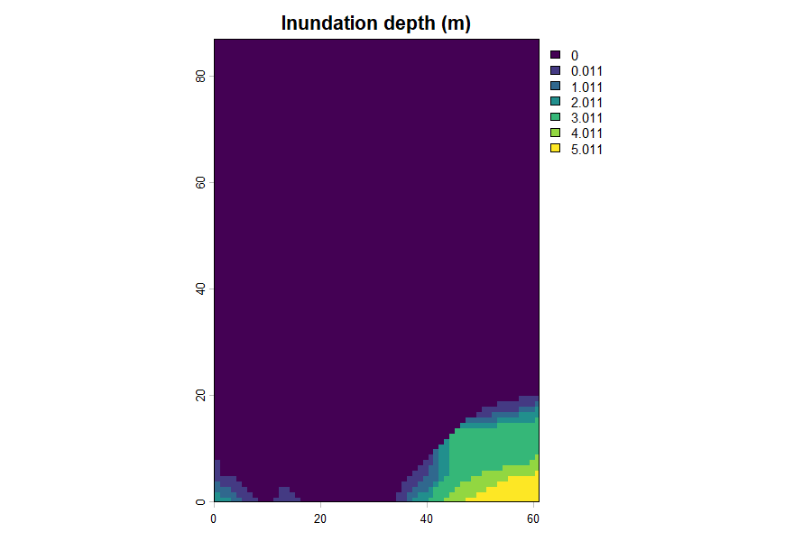

*Figure 11. Inundation depth; the HAND method keeps cells above the flood dry.*

## 23. The velocity map

How fast water moves matters as much as how deep — fast flow sweeps people and vehicles away.
Velocity comes from Manning's equation using each cell's depth, roughness and slope.

**↑ Continues from above**

```r
depth_field <- app(depth, function(v) ifelse(v < 0.05, 0.05, v))
velocity <- (1/manning) * depth_field^(2/3) * sqrt(slope_tan)
plot(velocity, main = "Flow velocity (m/s)")
```

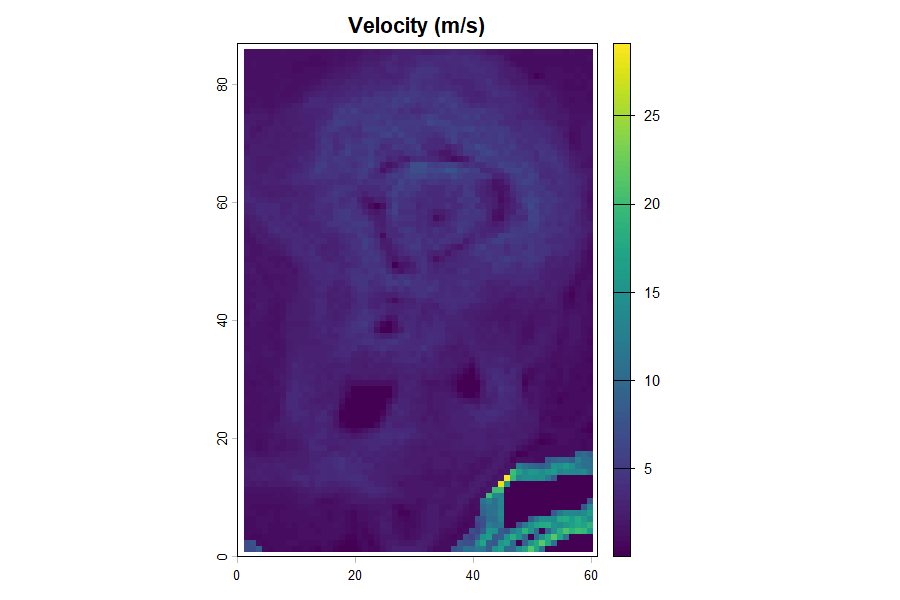

*Figure 12. Velocity — the fastest flow follows steep flanks, not the flat valley floor.*

Discharge per cell then follows from continuity, `Q = velocity × width × depth`:

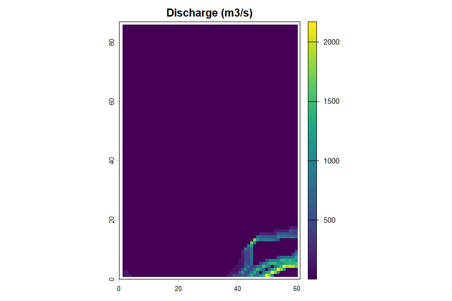

*Figure 13. Per-cell discharge from velocity, width and depth.*

## 24. Time-bound maps

For early warning we need timing: how long before the flood reaches a place. A travel-time map
shows the minutes for water to flow from each cell to the outlet — distance divided by velocity.

**↑ Continues from above**

```r
outlet_r <- dem; values(outlet_r) <- NA
outlet_r[which.min(values(dem))] <- 1
travel_min <- (distance(outlet_r) / velocity) / 60
plot(travel_min, main = "Travel time to outlet (minutes)")
```

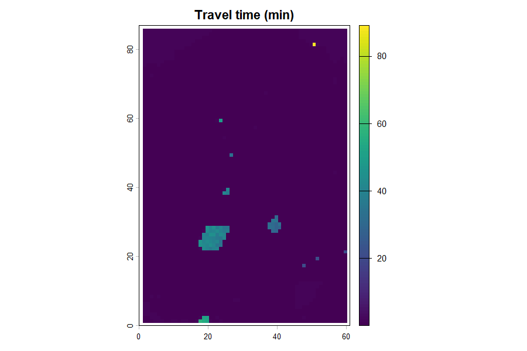

*Figure 14. Travel time to the outlet — the map that sets evacuation lead times.*

## 25. The complete spatial script

Every map from this Part, in one runnable block on the `volcano` DEM. Change the two `YOUR DATA`
lines for your basin. Note what the package draws directly (depth via `flood_route(hand=)`, risk
via `flood_vulnerability()`) versus what you compute yourself with the Manning and continuity
equations — the point is that you apply the theory, not call a black box.

**▶ Runs on its own**

```r
library(terra); library(floodflow); data("accra_rainfall")

# --- terrain inputs ---
dem <- rast(volcano)                 # YOUR DATA: rast("dem.tif")
crs(dem) <- "EPSG:32630"
slope <- terrain(dem, v = "slope", unit = "radians")
slope_tan <- app(tan(slope), function(v) ifelse(v<1e-4,1e-4,v))
hand <- dem - global(dem, "min", na.rm=TRUE)[1,1]
ndvi <- app(0.8 - 0.6*(dem-global(dem,"min",na.rm=TRUE)[1,1]) /
        (global(dem,"max",na.rm=TRUE)[1,1]-global(dem,"min",na.rm=TRUE)[1,1]),
        function(v) pmin(pmax(v,0),1))          # YOUR DATA: rast("ndvi.tif")

manning <- roughness(ndvi, method = "ndvi")$n           # MAP 1: roughness (package)

fp <- flood_project("basin", crs = crs(dem))            # lumped -> MAP 2: depth (package)
fp$rainfall <- accra_rainfall
fp <- flood_runoff(fp, engine = "simple")
fp <- flood_route(fp, area_km2 = 200, hand = hand)
depth <- fp$route$depth_raster
width <- fp$route$settings$width

df <- app(depth, function(v) ifelse(v<0.05,0.05,v))     # MAP 3: velocity (you compute)
velocity <- (1/manning) * df^(2/3) * sqrt(slope_tan)
discharge <- velocity * width * df                      # MAP 4: discharge Q = v*A

outlet_r <- dem; values(outlet_r) <- NA                 # MAP 5: travel time
outlet_r[which.min(values(dem))] <- 1
travel_min <- (distance(outlet_r) / velocity) / 60

risk <- flood_vulnerability(depth/global(depth,"max",na.rm=TRUE)[1,1],  # MAP 6: risk (package)
          exposure = setValues(dem, rpois(ncell(dem),50)),
          vulnerability = setValues(dem, runif(ncell(dem))))
```

| Map | How you get it | Package or you? |
|---|---|---|
| Roughness (*n*) | `roughness(ndvi, method='ndvi')` | package |
| Depth / inundation | `flood_route(hand=...)$depth_raster` | package |
| Velocity | `(1/n) * h^(2/3) * sqrt(S)` | you compute |
| Discharge (local) | `Q = velocity * width * depth` | you compute |
| Discharge (cumulative) | whitebox LDD × `flood_runoff()` rate | both |
| Travel time | `distance(outlet) / velocity` | you compute |
| Risk | `flood_vulnerability()` | package |

*Table 3. What the package draws directly, and what you compute from theory.*

## 26. Maps for every day, not just the peak

To watch a flood move, loop over the daily routed series and draw one depth map per day, then
let an animation package assemble them. The lumped depth-over-time curve for a single event
looks like this:

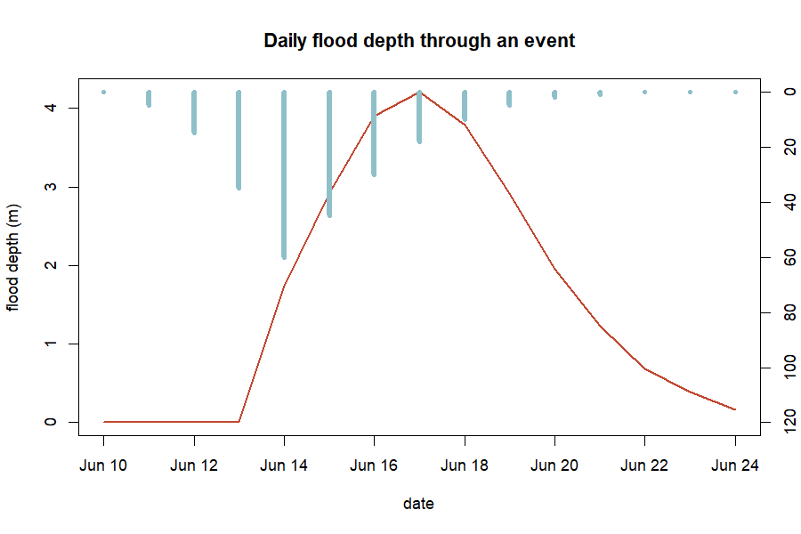

*Figure 15. Daily flood depth through an event (red), over the rainfall that drove it (blue) —
depth lags and outlasts the rain.*

## 27. Saving your maps, and troubleshooting

Save any raster with `terra::writeRaster(depth, "depth.tif", overwrite = TRUE)` and any plot
with `png()` / `dev.off()`. The commonest errors and fixes:

| Error | Cause | Fix |
|---|---|---|
| `object 'dem' not found` | skipped the DEM setup | run the Section 19 block first |
| `No rainfall data found` | `flood_runoff` before rainfall set | set `fp$rainfall` first |
| `NA values in slope` | flat cells, divide-by-zero | floor it: `ifelse(slope < 1e-4, 1e-4, slope)` |
| `could not find function 'rast'` | terra not loaded | `library(terra)` before spatial code |
| `whitebox: command not found` | whitebox not initialised | `install.packages('whitebox'); wbt_init()` |
| `object 'manning' not found` | ran a block out of order | run the section top to bottom |

*Table 4. Common errors and fixes. Most come from running a 'Continues from above' block on its
own — use the complete script in Section 25.*

---

# PART 3 — Exercises, projects and reference

## 28. Citing floodflow

If you use floodflow in teaching or research, please cite it:

> Owusu, G. (2026). *floodflow: Climate-informed flood modelling in R.* Version 0.2.0.
> Department of Geography and Resource Development, University of Ghana.

You can also run `citation("floodflow")` in R for the current reference.

## 29. Reproducing the figures

Every figure is drawn from data floodflow computes on the real `accra_rainfall` record. To
regenerate them, run the `reproduce_manual.R` script that ships in this `manual/` folder:

**▶ Runs on its own**

```r
source("reproduce_manual.R")     # writes every figure as a PNG into figures/
```

The script loads `accra_rainfall`, runs the full pipeline and draws each figure with base-R
graphics. The Part 2 spatial figures need `terra` installed. This is what reproducibility means
in practice: the numbers, and the pictures, come from code you can run.

## 30. Glossary of terms

- **Attenuation** — the flattening and shrinking of a flood peak as it travels downstream.
- **Catchment / basin** — land area draining to a common outlet.
- **CRS** — coordinate reference system; the map projection of spatial data.
- **Delta method** — climate-adjusting rainfall by multiplying by a change factor.
- **Discharge** — water flow rate, in m³/s or mm/day.
- **Equifinality** — when many different parameter sets fit the data equally well.
- **Evapotranspiration (PET)** — water lost to air and plants.
- **GEV** — Generalized Extreme Value distribution, for annual maxima.
- **GLUE** — Generalized Likelihood Uncertainty Estimation.
- **HAND** — Height Above Nearest Drainage; each cell's height above its local channel.
- **Hydrograph** — a graph of discharge over time.
- **Lumped vs. spatial** — lumped = one value per basin; spatial = a value in every grid cell.
- **Manning's *n*** — surface roughness controlling flow speed.
- **NDVI** — Normalised Difference Vegetation Index; satellite greenness, 0 to 1.
- **Return period** — average frequency of a given event size (e.g. 100-year storm).
- **Routing** — moving a flood wave downstream and computing its depth.
- **SSP** — Shared Socioeconomic Pathway; a standard climate-future scenario.
- **Time of concentration** — time for water to cross the catchment to the outlet.

## 31. Exercises

Work each formula by hand (a calculator is enough), then run the package to check. Set up first:

**▶ Runs on its own**

```r
library(floodflow)
data("accra_rainfall")
ext <- flood_extremes(accra_rainfall)
```

1. **(easy) Return level.** Using the GEV formula and the fitted parameters in
   `ext$stationary$par`, compute the 25-year design rainfall by hand, then check against
   `ext$return_levels`. *Answer: about 76 mm.*
2. **(easy) Time of concentration.** A catchment has a 5000 m channel at 1.5% slope. Compute
   `tc` with Kirpich by hand, then verify with `tc_kirpich(length_m = 5000, slope = 0.015)`.
   *Answer: about 69 minutes.*
3. **(medium) Evapotranspiration.** Compute PET for a 30 °C day at day 150 at latitude 5.6°N
   with `pet_oudin(jday = 150, temp_c = 30, lat_deg = 5.6)`. If 40 mm of rain fell that day,
   roughly how much is left after PET? *Answer: PET ≈ 5 mm, so ~35 mm remains — PET is a small
   correction on a big storm but dominates on light-rain days.*
4. **(medium) Discharge and depth.** Using `Q = (width/n)·h^(5/3)·√S`, compute discharge for a
   30 m channel, n = 0.04, S = 0.003, at depths of 1 m and 1.5 m. By what factor does Q grow?
   *Answer: ~41 and ~80 m³/s — a factor of 1.5^(5/3) ≈ 1.97, from just 50% more depth.*
5. **(harder) Put it together.** Run the full lumped pipeline (Sections 3–13) on
   `accra_rainfall`. (a) What is the 100-year design rainfall? (b) What peak depth does
   `flood_route` give at `area_km2 = 200` versus `400`? (c) Why does more area raise depth?
   *Answer: (a) ~110 mm; (b) shallower at 200, deeper at 400; (c) a larger area collects more
   runoff, so discharge and depth rise.*

## 32. Projects

Longer, open-ended projects — each a small change to code you already have. They make good class
assignments or a first real piece of analysis.

1. **Your own city.** Use `sebkc::weather()` (Section 4) to fetch a 40-year daily record for
   your town, run Part 1, and report its 100-year storm and design flood depth. How do they
   compare with Accra?
2. **Design a culvert.** Pick a road crossing. Using the 25-year design rainfall and
   `flood_route()`, find the channel width that keeps peak depth below 1.5 m. That width sizes
   the culvert.
3. **How rare was the last big flood?** Find the daily rainfall of a real flood in your area
   (news or a gauge), fit the GEV with `flood_extremes()`, and compute its return period — then
   repeat under a +20% climate scenario.
4. **A climate sweep.** Loop `flood_scenario()` over change factors 1.0, 1.1, 1.2, 1.3 and plot
   how the 100-year design flood *depth* grows. Where does risk rise fastest?
5. **Wet year vs dry year.** Split `accra_rainfall` into its wettest and driest years, run the
   runoff and routing for each, and compare peak depth. How much does antecedent wetness matter?
6. **Uncertainty on your basin.** Take a measured or estimated flood mark and run
   `flood_uncertainty()`. Report the 90% band and the equifinality between roughness and width.
7. **Vulnerability hotspots.** Build simple exposure (population) and vulnerability (deprivation)
   layers for a neighbourhood and map `flood_vulnerability()`. Where would you place early-warning
   sirens?
8. **Compare the routing ladder.** Route the same flood through all five methods and quantify how
   much each attenuates the peak. Which would you trust for a steep basin, and why?

## 33. References

The methods floodflow implements draw on the following published work; each is cited in the
relevant section and in the package help (e.g. `?flood_route`).

- Beven, K. & Binley, A. (1992). The future of distributed models: model calibration and
  uncertainty prediction. *Hydrological Processes*, 6(3), 279–298. [GLUE uncertainty]
- Chow, V. T. (1959). *Open-Channel Hydraulics.* McGraw-Hill. [Manning roughness]
- Coles, S. (2001). *An Introduction to Statistical Modeling of Extreme Values.* Springer.
  [GEV extreme-value theory]
- Cunge, J. A. (1969). On the subject of a flood propagation computation method (Muskingum
  method). *Journal of Hydraulic Research*, 7(2), 205–230. [Muskingum-Cunge routing]
- IPCC (2021). *Climate Change 2021: The Physical Science Basis.* Cambridge University Press.
  [Climate scenarios]
- Kirpich, Z. P. (1940). Time of concentration of small agricultural watersheds. *Civil
  Engineering*, 10(6), 362. [Time of concentration]
- Manning, R. (1891). On the flow of water in open channels and pipes. *Transactions of the
  Institution of Civil Engineers of Ireland*, 20, 161–207. [Manning's equation]
- Nobre, A. D. et al. (2011). Height Above the Nearest Drainage — a hydrologically relevant new
  terrain model. *Journal of Hydrology*, 404, 13–29. [HAND inundation]
- Oudin, L. et al. (2005). Which potential evapotranspiration input for a lumped rainfall-runoff
  model? *Journal of Hydrology*, 303, 290–306. [Oudin PET]
- Perrin, C., Michel, C. & Andréassian, V. (2003). Improvement of a parsimonious model for
  streamflow simulation. *Journal of Hydrology*, 279, 275–289. [GR4J runoff, via airGR]
- NASA POWER Project. *Prediction of Worldwide Energy Resources — Daily data.*
  <https://power.larc.nasa.gov>. [Source of the `accra_rainfall` record, via `sebkc::weather()`]

The June 2026 Accra flood figures in Section 7 are the official statistics reported by the Ghana
Meteorological Agency (GMet) and stated by the Minister for the Interior to Parliament in June
2026, as carried by Ghanaian and international news outlets. They are cited as reported public
record, not as package output.

## 34. Appendix: the code behind every figure

The complete `reproduce_manual.R` is printed here so the code that draws every figure lives
inside the manual itself. Run it (or `source("reproduce_manual.R")`) and each figure is
regenerated as a PNG in a `figures/` folder. The Part 2 spatial figures need `terra`.

**▶ Runs on its own**

```r
library(floodflow)
data("accra_rainfall")
dir.create("figures", showWarnings = FALSE)
png_ <- function(name) png(file.path("figures", name), width = 900, height = 600, res = 110)
rain <- accra_rainfall

fp <- flood_project("Odaw basin, Accra")
fp$rainfall <- rain
fp <- flood_extremes(fp)

## Figure 1 — annual maxima
am <- tapply(rain$precip_mm, format(rain$date, "%Y"), max); yrs <- as.integer(names(am))
png_("fig01_annual_maxima.png")
plot(yrs, am, type="b", pch=19, col="#1f7a8c", xlab="year",
     ylab="annual max daily rain (mm)", main="Annual maximum rainfall, 1981-2026")
abline(lm(am ~ yrs), col="#c1462f", lwd=2); dev.off()

## Figure 2 — present vs future return levels
rl <- fp$extremes$return_levels
png_("fig02_return_levels.png")
barplot(rbind(rl$level_mm, rl$level_mm*1.20), beside=TRUE,
        names.arg=paste0(rl$period,"-yr"), col=c("#1f7a8c","#c1462f"),
        ylab="design rainfall (mm)", main="Design rainfall: present vs mid-century (+20%)")
legend("topleft", c("present-day","SSP2-4.5 2050"), fill=c("#1f7a8c","#c1462f"), bty="n")
dev.off()

## Figures 3 & 4 — the June 2026 event (cited GMet figures)
png_("fig03_daily_jump.png")
plot(c(2024,2026), c(56,169.2), type="b", pch=19, col="#c1462f", lwd=2,
     xlim=c(2023.7,2026.3), ylim=c(0,190), xaxt="n", xlab="",
     ylab="highest daily rainfall (mm)", main="Accra daily rainfall record")
axis(1, at=c(2024,2025,2026))
abline(h=110.1, lty=2, col="#1f7a8c"); abline(h=132.1, lty=2, col="#0a3d52")
text(2024.2, 116, "present-day 100-yr (110 mm)", cex=0.8, col="#1f7a8c", pos=4)
text(2024.2, 138, "SSP2-4.5 2050 100-yr (132 mm)", cex=0.8, col="#0a3d52", pos=4); dev.off()

png_("fig04_monthly_record.png")
barplot(c(380.3,420.6,593.2), names.arg=c("2015","2002","June 2026"),
        col=c("#8fc0c9","#1f7a8c","#c1462f"), ylab="June rainfall (mm)",
        main="Ghana's wettest month on record (June 2026)"); dev.off()

## Figure 5 — hydrograph; Figure 6 — water balance; Figure 7 — routing ladder
fp <- flood_runoff(fp, engine="simple"); q <- fp$runoff$discharge
sub <- q[q$date >= "2023-06-01" & q$date <= "2023-09-30", ]
png_("fig05_hydrograph.png")
plot(sub$date, sub$Q_mm, type="l", col="#1f7a8c", lwd=2, xlab="date",
     ylab="discharge (mm/day)", main="Flood hydrograph (2023 wet season)"); dev.off()

mo <- as.integer(format(rain$date,"%m"))
Pm <- tapply(rain$precip_mm, mo, sum); PETm <- tapply(fp$runoff$pet, mo, sum)
Qm <- tapply(q$Q_mm, mo, sum)
png_("fig06_water_balance.png")
barplot(rbind(as.numeric(Pm), as.numeric(PETm)), beside=TRUE, names.arg=month.abb,
        col=c("#1f7a8c","#c1462f"), ylab="mm/month",
        main="Water balance: rainfall, evaporation, runoff")
lines(seq(2, by=3, length.out=12), as.numeric(Qm), type="b", pch=19, col="#0a3d52", lwd=2)
dev.off()

## (Part 2 spatial figures 8-15 use the base-R volcano DEM + terra; see the full
##  reproduce_manual.R in this folder for the complete spatial block.)
```

---

*floodflow — map-first, climate-informed flood assessment for data-scarce basins. This manual and
all its numbers were produced by running the package on the real, bundled `accra_rainfall`
record.*
